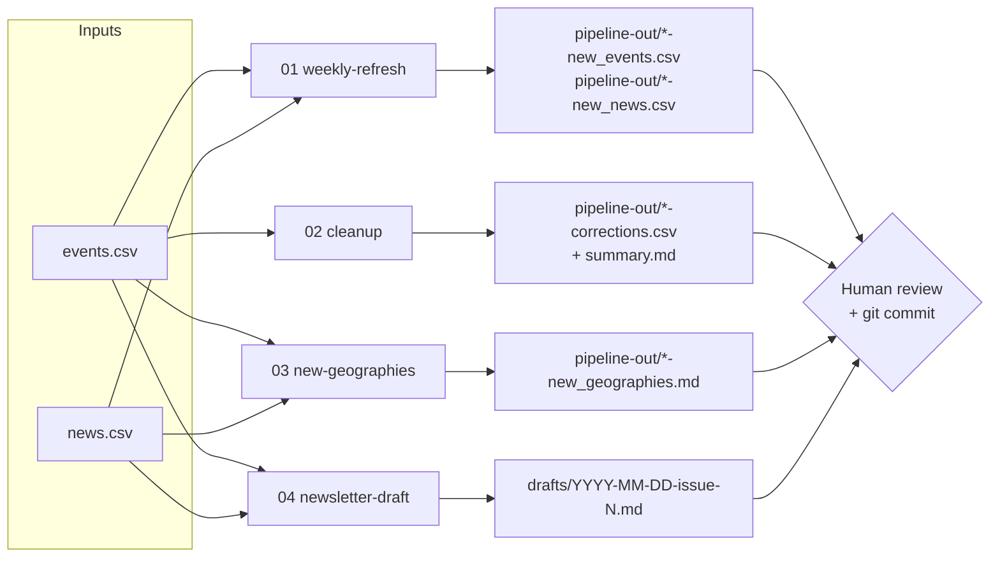

# AV Map data pipeline — V2 architecture

## Why we migrated from V1

V1 ([`path-avmap/av-map-agents`](https://github.com/path-avmap/av-map-agents))
is an autonomous multi-agent system running on AWS Lambda + EventBridge,
extracting events via Claude on **AWS Bedrock**, staging candidates in
Supabase, and serving a React review dashboard. It works, but it is
heavyweight to operate and reason about: Lambda packaging, Bedrock IAM
keys that rotate and break unattended runs, a Supabase staging table,
and a separate dashboard deploy. For a research project maintained by
one person, that is too much surface area.

V2 collapses the cognitive work into **three focused prompts behind one
CLI**, talking to the **direct Anthropic API** (no Bedrock, no rotating
AWS keys). Output is plain files a human reviews and commits. No Lambda,
no staging DB, no dashboard required.

V1 is **not deleted** — it remains in the `av-map-agents` repo and is
referenced from [`/legacy/README.md`](../legacy/README.md) so we can
roll back.

## The three prompts (+ newsletter)



| Prompt | File | Model | Output |
|--------|------|-------|--------|
| Weekly refresh | `prompts/01-weekly-refresh.md` | Sonnet | `pipeline-out/<date>-new_events.csv`, `-new_news.csv` |
| Cleanup | `prompts/02-cleanup.md` | Sonnet | `pipeline-out/<date>-corrections.csv`, `-corrections_summary.md` |
| New geographies | `prompts/03-new-geographies.md` | Opus (higher reasoning) | `pipeline-out/<date>-new_geographies.md` |
| Newsletter | `prompts/04-newsletter-draft.md` | Sonnet | `drafts/<date>-issue-<N>.md` |

Nothing is auto-committed. Every output lands in `pipeline-out/` or
`drafts/` for a human to review, validate (`pytest tests/`), and commit.

## How to run

```bash
export ANTHROPIC_API_KEY=sk-ant-...

npm run pipeline:refresh -- --since=2026-05-08
npm run pipeline:cleanup
npm run pipeline:geo
npm run pipeline:newsletter -- --since=2026-05-08 --issue=1
```

Models are overridable via env:

- `PIPELINE_MODEL` — default `claude-sonnet-4-5` (refresh, cleanup,
  newsletter)
- `PIPELINE_MODEL_GEO` — defaults to `PIPELINE_MODEL`; set to an Opus
  model id (e.g. `claude-opus-4-1`) for the geography scout where
  deeper reasoning pays off. Left at the Sonnet default by design so a
  fresh clone never 400s on an unverified model id — opt in explicitly.

## Adding a new prompt

1. Write `prompts/0N-name.md` with the standard sections:
   `# Role`, `# Task`, `# Inputs`, `# Output format`,
   `# Quality checks to self-run`.
2. Add the key to `PROMPT_FILE` and `VALID` in
   `scripts/v2-pipeline.mjs`.
3. Add an output branch in `main()` that extracts the fenced block(s)
   and writes them under `pipeline-out/` (or `drafts/`).
4. Add an npm alias in `package.json`.

## Rough cost per run

Inputs are dominated by `events.csv` (~80 KB) + `news.csv` (~10 KB),
sent as a cached system-adjacent payload. Per run that is roughly
~30k input tokens (prompt-cached after first call) and 1-4k output
tokens. With Sonnet that is well under $0.10 per run, or a few dollars
a year at a weekly cadence. The Opus geo run is the most expensive and
still cents.
